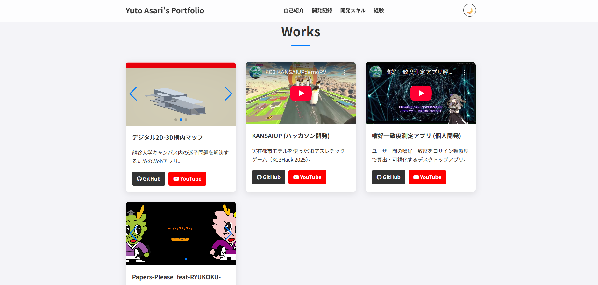

# Yuto Asari's Portfolio



## 🔗 サイトURL

**https://kishinokay.github.io/**

## 💡 コンセプト

「**シンプルで見やすく、モダンなUI**」をテーマに、自身のスキルや制作物をまとめたポートフォリオサイトです。
採用担当者の方や、私に興味を持ってくださった方が、私の人となりや技術力を直感的に理解できるよう設計しました。特に、各プロジェクトの詳細をスムーズに確認できるよう工夫しています。

---

## ✨ 主な機能

* **レスポンシブデザイン**: PC、タブレット、スマートフォンなど、あらゆるデバイスで最適に表示されます。
* **ダークモード切り替え機能**: ユーザーの好みに合わせてライトモードとダークモードを切り替え可能です。設定はブラウザに保存され、次回の訪問時にも適用されます。
* **制作物カードUI**: 各制作物をカード形式で表示し、視覚的な分かりやすさを追求しました。
* **作品詳細モーダル**: 各作品カードをクリックすると、プロジェクト概要、開発環境、担当箇所、技術的・こだわりポイントなどの詳細がモーダルウィンドウで表示されます。
* **Swiperスライダー**: 各作品の画像や動画は、Swiper.jsを用いたスライダーで直感的に閲覧できます。
* **スムーズスクロール**: ヘッダーのナビゲーションメニューから各セクションへスムーズに移動できます。

---

## 🛠️ 使用技術

このサイトおよび紹介されているプロジェクトは、以下の技術を使用して構築されています。

### サイト構築

* **HTML5**
* **CSS3**: Flexbox, Gridレイアウト, CSS変数 (カラーテーマ管理)
* **JavaScript (Vanilla JS)**: DOM操作によるダークモード、Swiper.js連携、モーダル機能の実装

### プロジェクト開発技術

* **プログラミング言語**: Python, C#, JavaScript, TypeScript
* **フレームワーク/ライブラリ**: Unity, React, Vite, Flet
* **スタイル**: Tailwind CSS
* **3Dモデリング**: Blender
* **その他**: FastAPI, Ubuntu Server, Photon Unity Networking 2, ChatGPT API, SQLite, Git/GitHub, Notion (プロジェクト管理), Figma (デザイン)

---

## 🚀 開発記録 (Works)

### 1. デジタル2D-3D構内マップ

* **概要**: 龍谷大学キャンパス内の迷子問題を解決するためのWebアプリ。
* **開発期間**: 4ヶ月
* **チーム規模**: 6人
* **担当箇所**: プロジェクトマネジメント、3Dモデリング、進捗管理
* **技術的なポイント**: UnityとReactのWebGL連携、2D/3Dマップ切替と経路探索、GPS誤差補正、シームレスなUI/UX設計、サーバー自前構築とデプロイ。
* **こだわりポイント**: Notionでの仕様・スケジュール管理とチームのコミュニケーション促進、NavMesh生成や3Dモデルの最適化、メンバーの課題解決サポートと全体の進行調整。
* **GitHub (Frontend)**: [https://github.com/0xygen123/PR_Frontend](https://github.com/0xygen123/PR_Frontend)
* **GitHub (Map)**: [https://github.com/0xygen123/PR_Map](https://github.com/0xygen123/PR_Map)
* **YouTube**: [https://www.youtube.com/your-pr-video-link](https://www.youtube.com/your-pr-video-link)

### 2. KANSAIUP (ハッカソン開発)

* **概要**: KC3Hack 2025にて、実在都市モデルを使った3Dアスレチックゲームを開発。
* **開発期間**: 7日間
* **チーム規模**: 3人
* **担当箇所**: プロジェクト管理、企画・レベルデザイン、仕様策定・ドキュメント化
* **技術的なポイント**: PLATEAU都市モデルによる没入感の演出、Photon Unity Networking 2 を用いたオンラインマルチプレイ実装、ChatGPT API連携によるAI関西解説。
* **こだわりポイント**: リスク管理とタスク分担の徹底、短期間での高品質なアウトプット、教育的要素とゲーム性の両立。
* **GitHub**: [https://github.com/kc3hack/2025_21](https://github.com/kc3hack/2025_21)
* **YouTube**: [https://youtu.be/D4d2Q8z6aSA?si=oucsI7N2TbInVAJM](https://youtu.be/D4d2Q8z6aSA?si=oucsI7N2TbInVAJM)

### 3. 嗜好一致度測定アプリ (個人開発)

* **概要**: 大学プログラミングサークル活動の一環で、ユーザー間の嗜好一致度をコサイン類似度で算出・可視化するデスクトップアプリ。
* **開発期間**: 1週間
* **チーム規模**: 個人開発
* **担当箇所**: 企画、設計、実装、UIデザイン、テストまで全工程を担当。
* **技術的なポイント**: ユーザー入力データをベクトル化し、コサイン類似度で一致度を算出、Flet（Python製UIフレームワーク）によるクロスプラットフォーム対応、SQLiteによるデータ永続化。
* **こだわりポイント**: 日本語情報が少ないFletの公式ドキュメントを徹底的に読み込み、サンプルコードを分解・検証しながら仕様を理解、シンプルで直感的な操作性を重視したUI設計。
* **GitHub**: [https://github.com/KishinoKay/DOMINATORN](https://github.com/KishinoKay/DOMINATORN)
* **YouTube**: [https://youtu.be/ohMR_FIygZo](https://youtu.be/ohMR_FIygZo)

### 4. Papers-Please_feat-RYUKOKU-

* **概要**: 「Papers, Please」風のゲームシステムをUnityで再現し、龍谷大学の要素を盛り込んだオリジナル作品。
* **開発期間**: 2ヶ月
* **チーム規模**: 4人
* **担当箇所**: ゲームシステム設計、UI/UX設計、主要スクリプト実装、仕様書作成
* **技術的なポイント**: 複数シーン構成によるゲーム進行管理、ScriptableObjectやJSONによるデータ管理。
* **こだわりポイント**: 大学オリジナル要素の追加と世界観の再現、プレイヤー体験を意識した演出、仕様書・設計書を整備し、共同開発の効率化。
* **GitHub**: [https://github.com/KishinoKay/Papers-Please_feat-RYUKOKU-](https://github.com/KishinoKay/Papers-Please_feat-RYUKOKU-)

---

## 🛠️ セットアップ方法

このポートフォリオサイトのテンプレートとして使用する際の手順は以下の通りです。

1.  このリポジトリを`Fork`するか、`git clone`でローカルにクローンします。
    ```bash
    git clone [https://github.com/KishinoKay/KishinoKay.github.io.git](https://github.com/KishinoKay/KishinoKay.github.io.git)
    ```
2.  `index.html`内のテキストや画像パスを、ご自身の情報に合わせて書き換えます。
    * `images/profile.jpg`をご自身のプロフィール画像に置き換えてください。
    * 各作品の画像 (`images/PRMap/`, `images/Papers-Please_feat-RYUKOKU-/` 内の画像など) をご自身のプロジェクト画像に更新してください。
3.  `style.css`の`--accent-color`など、CSS変数の値を変更し、お好みのカラーテーマにカスタマイズします。
4.  ご自身のGitHub Pagesリポジトリ (`アカウント名.github.io` など) にプッシュして公開します。

---

## 👤 作者

* **名前**: Kishino
* **GitHub**: [https://github.com/kishinokay](https://github.com/kishinokay)
* **Qiita**: [https://qiita.com/KishinoKay](https://qiita.com/KishinoKay)